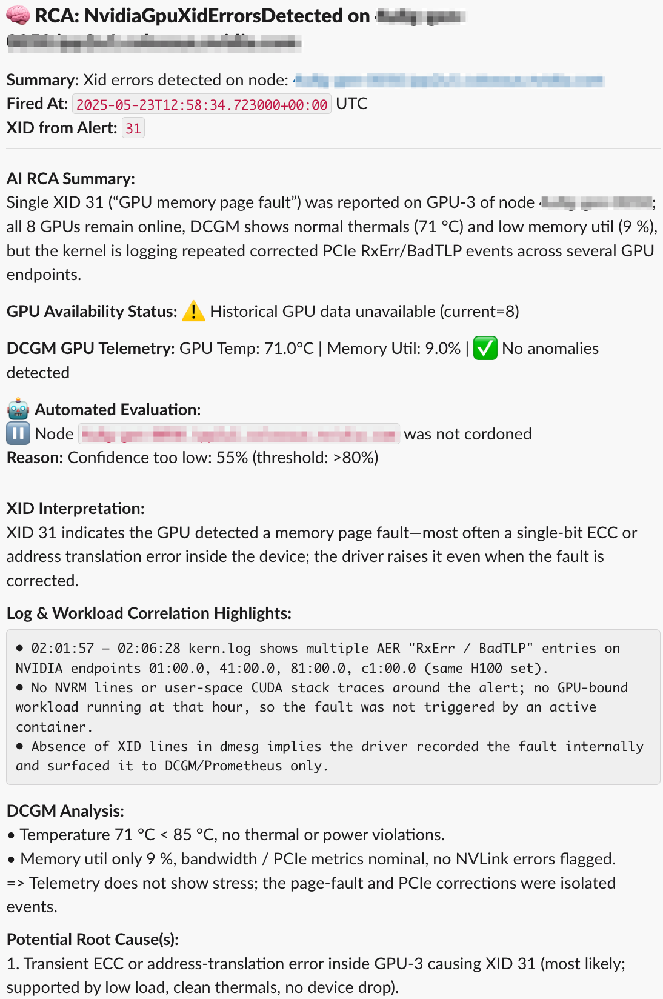

# Seneca - GPU XID Root Cause Analysis Service

A comprehensive SRE service for automated root cause analysis of NVIDIA GPU XID errors in Kubernetes clusters.

## Example Output



*Real-world example: Seneca automatically analyzed XID 31 error, correlated logs and metrics, and provided detailed root cause analysis with confidence scoring.*

## Overview

Seneca is an intelligent monitoring and analysis service that:

- 🔍 **Automated RCA**: Receives GPU XID error alerts and performs AI-powered root cause analysis
- 📊 **Comprehensive Data Collection**: Fetches system logs, GPU metrics, and workload information
- 🤖 **LLM-Powered Analysis**: Uses OpenAI to analyze collected data and provide detailed insights
- 🚨 **Slack Integration**: Sends formatted analysis reports to Slack channels
- 🔧 **Auto-Remediation**: Optionally cordons problematic nodes based on confidence levels
- 📈 **Full Observability**: Exports metrics to Prometheus and includes health checks

## Features

### Core Capabilities
- **Alert Processing**: Webhook endpoint for Alertmanager notifications
- **Log Collection**: Automated fetching of kernel logs, dmesg, and syslog from affected nodes
- **GPU Metrics**: Integration with DCGM metrics for hardware telemetry
- **Workload Analysis**: Queries Prometheus for GPU workload context
- **Intelligent Caching**: Deduplicates RCA requests to avoid redundant analysis
- **Queue Management**: Handles high-volume alerts with configurable processing queues

### AI-Powered Analysis
- **Multi-Modal Analysis**: Combines logs, metrics, and workload data for comprehensive RCA
- **Confidence Scoring**: Provides reliability indicators for analysis results
- **Anomaly Detection**: Identifies patterns in GPU telemetry data
- **Root Cause Classification**: Categorizes issues (hardware, software, workload, environmental)

### Production Features
- **High Availability**: Kubernetes-native deployment with proper resource management
- **Security**: Distroless container images, RBAC, and secret management
- **Scalability**: Configurable worker threads and queue sizes
- **Monitoring**: OpenTelemetry metrics and Prometheus integration
- **Health Checks**: Comprehensive health and readiness endpoints

## Quick Start

### Prerequisites
- Kubernetes cluster with RBAC enabled
- Prometheus server with GPU metrics (DCGM)
- OpenAI API key
- Slack webhook URL
- Helm 3.0+

### Installation

1. **Clone the repository**:
   ```bash
   git clone https://github.com/endyrocket/seneca.git
   cd seneca
   ```

2. **Install with Helm**:
   ```bash
   helm install seneca ./helm-chart \
     --set secrets.openaiApiKey="your-openai-api-key" \
     --set secrets.slackWebhookUrl="your-slack-webhook-url" \
     --set config.prometheusUrl="http://your-prometheus:9090"
   ```

3. **Configure Prometheus Alerting Rules**:
   ```yaml
   # prometheus-rules.yaml
   groups:
   - name: gpu-xid-errors
     rules:
     - alert: NvidiaGpuXidErrorsDetected
       expr: |
         increase(DCGM_FI_DEV_XID_ERRORS[5m]) > 0
       for: 1m
       labels:
         severity: high
       annotations:
         summary: "XID errors detected on node: {{ $labels.node}}"
         description: "Node {{ $labels.node }} has XID errors detected. GPU: {{ $labels.gpu }}, Device: {{ $labels.device }}"
   ```

4. **Configure Alertmanager**:
   ```yaml
   # alertmanager.yml
   route:
     receiver: seneca-rca
   
   receivers:
   - name: seneca-rca
     webhook_configs:
     - url: http://seneca/webhook
       send_resolved: true
   ```

## Configuration

### Environment Variables
- `OPENAI_API_KEY`: OpenAI API key for LLM analysis
- `SLACK_WEBHOOK_URL`: Slack webhook URL for notifications
- `PROMETHEUS_URL`: Prometheus server URL for metrics queries
- `ENABLE_AUTO_CORDON`: Enable automatic node cordoning (default: true)
- `AUTO_CORDON_CONFIDENCE_THRESHOLD`: Confidence threshold for auto-cordoning (default: 80)

### Helm Configuration
See [helm-chart/README.md](helm-chart/README.md) for complete configuration options.

## Prometheus Setup

### Required Metrics
Seneca requires DCGM metrics to be available in Prometheus. Ensure you have:

```yaml
# Essential DCGM metrics for XID analysis
- DCGM_FI_DEV_XID_ERRORS
- DCGM_FI_DEV_GPU_TEMP
- DCGM_FI_DEV_MEM_COPY_UTIL
- DCGM_FI_DEV_GPU_UTIL
- DCGM_FI_DEV_POWER_USAGE
- DCGM_FI_DEV_PCIE_TX_THROUGHPUT
- DCGM_FI_DEV_PCIE_RX_THROUGHPUT
```

### Sample Alerting Rules
```yaml
groups:
- name: gpu-monitoring
  rules:
  - alert: NvidiaGpuXidErrorsDetected
    expr: |
      increase(DCGM_FI_DEV_XID_ERRORS[5m]) > 0
    for: 1m
    labels:
      severity: high
    annotations:
      summary: "XID errors detected on node: {{ $labels.node}}"
      description: "Node {{ $labels.node }} has XID errors detected. GPU: {{ $labels.gpu }}, Device: {{ $labels.device }}"
  
  - alert: GpuHighTemperature
    expr: DCGM_FI_DEV_GPU_TEMP > 85
    for: 5m
    labels:
      severity: warning
    annotations:
      summary: "High GPU temperature on {{ $labels.node }}"
      description: "GPU {{ $labels.gpu }} temperature is {{ $value }}°C"
  
  - alert: GpuEccErrors
    expr: increase(DCGM_FI_DEV_ECC_SBE_VOL_TOTAL[10m]) > 0
    for: 1m
    labels:
      severity: warning
    annotations:
      summary: "ECC errors detected on {{ $labels.node }}"
      description: "GPU {{ $labels.gpu }} has ECC errors"
```

## API Endpoints

- `POST /webhook` - Alertmanager webhook endpoint
- `GET /health` - Health check endpoint
- `GET /metrics` - Prometheus metrics endpoint

## Architecture

```
┌─────────────────┐    ┌─────────────────┐    ┌─────────────────┐
│   Alertmanager  │───▶│     Seneca      │───▶│     Slack       │
└─────────────────┘    └─────────────────┘    └─────────────────┘
                              │
                              ▼
                    ┌─────────────────┐
                    │   Kubernetes    │
                    │   (Log Fetch)   │
                    └─────────────────┘
                              │
                              ▼
                    ┌─────────────────┐
                    │   Prometheus    │
                    │   (DCGM Metrics)│
                    └─────────────────┘
                              │
                              ▼
                    ┌─────────────────┐
                    │    OpenAI       │
                    │  (Analysis)     │
                    └─────────────────┘
```

## Development

### Local Development
```bash
# Install dependencies
pip install -r requirements.txt

# Set environment variables
export OPENAI_API_KEY="your-key"
export SLACK_WEBHOOK_URL="your-webhook"
export PROMETHEUS_URL="http://localhost:9090"

# Run the service
python main.py --port 5001
```

### Docker Development
```bash
# Build the image
docker build -f Dockerfile.distroless -t seneca:dev .

# Run with environment variables
docker run -p 5001:5001 \
  -e OPENAI_API_KEY="your-key" \
  -e SLACK_WEBHOOK_URL="your-webhook" \
  seneca:dev
```

## Monitoring

Seneca exposes comprehensive metrics:
- `rca_alerts_received_total` - Total alerts received
- `rca_processing_duration_seconds` - Processing time histogram
- `rca_queue_size` - Current queue size
- `rca_cache_hits_total` - Cache performance metrics
- `rca_log_fetch_duration_seconds` - Log fetching performance

## Security Considerations

- **RBAC**: Service requires cluster-level permissions for log fetching and node management
- **Secrets**: Use Kubernetes secrets or external secret management
- **Network**: Consider network policies to restrict access
- **Containers**: Uses distroless images and non-root execution

## Troubleshooting

### Common Issues

1. **XID alerts not received**: Check Prometheus alerting rules and Alertmanager configuration
2. **Log fetching fails**: Verify RBAC permissions and cluster pod security policies
3. **GPU metrics unavailable**: Ensure DCGM exporter is running and metrics are scraped
4. **OpenAI API errors**: Verify API key and rate limits

### Debug Commands

```bash
# Check service logs
kubectl logs -f deployment/seneca

# Test webhook endpoint
curl -X POST http://seneca/webhook \
  -H "Content-Type: application/json" \
  -d '{"alerts": [{"status": "firing", "labels": {"alertname": "test"}}]}'

# Check health
curl http://seneca/health
```

## Contributing

1. Fork the repository
2. Create a feature branch
3. Make your changes
4. Add tests if applicable
5. Submit a pull request

## License

MIT License - see LICENSE file for details

## Support

For issues and questions:
- Create an issue in this repository
- Check the [troubleshooting guide](helm-chart/README.md#troubleshooting)
- Review the logs for detailed error information 